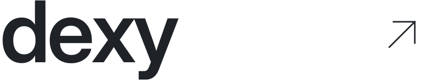

<h1>
  <a href="https://github.com/itzdexy?tab=repositories">
    <picture>
      <source media="(prefers-color-scheme: dark)" srcset="assets/profile-header-dark.svg" />
      <source media="(prefers-color-scheme: light)" srcset="assets/profile-header-light.svg" />
      
    </picture>
  </a>
</h1>

I build **developer tools, AI software, desktop apps, and Roblox projects**.  
I care about clean interfaces and useful features.

## Selected work

### [Graft ↗](https://github.com/itzdexy/Graft)

**An AI coding agent for your terminal.**

Edit code, run commands, and test websites in a local browser—with your choice of AI provider.

TypeScript · Bun · MIT · Source preview

[Code](https://github.com/itzdexy/Graft) &nbsp;·&nbsp; [Install](https://github.com/itzdexy/Graft#install) &nbsp;·&nbsp; [Preview](https://github.com/itzdexy/Graft/blob/main/docs/media/graft-chat.png)

## Toolkit

**Languages**  
`Luau` `TypeScript` `C++` `Python` `Rust` `HTML`

**Tools & frameworks**  
`Roblox Studio` `Tauri` `Node.js` `Bun` `Git`

Most of my work is still private. [Browse public repositories ↗](https://github.com/itzdexy?tab=repositories)
